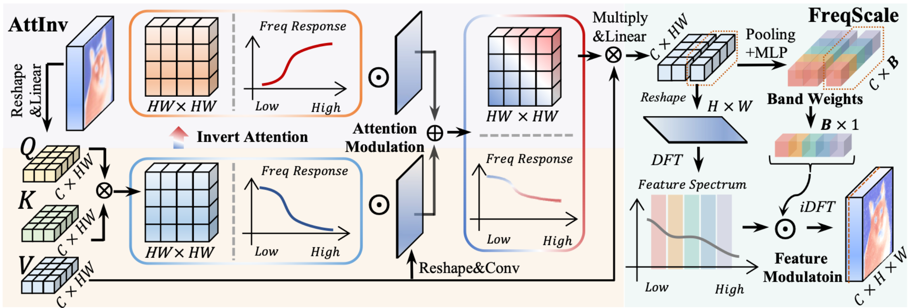

# FDAM: Frequency-Dynamic Attention Modulation

**[ICCV 2025]** Official implementation of *Frequency-Dynamic Attention Modulation for Dense Prediction* [(paper link)](https://arxiv.org/abs/2507.12006).

FDAM revitalizes Vision Transformers by tackling frequency vanishing. It dynamically modulates the frequency response of attention layers, enabling the model to preserve critical details and textures for superior dense prediction performance.


# 📰 News

- **2025-10-10** : [Training code](./FDAM_mmseg) and weights for DeiT-III-Base on ADE20K are now available.


## 🚀 Key Features

- **Attention Inversion (AttInv):** Inspired by circuit theory, AttInv inverts the inherent low-pass filter of the attention mechanism to generate a complementary high-pass filter, enabling a full-spectrum representation.
- **Frequency Dynamic Scaling (FreqScale):** Adaptively re-weights and amplifies different frequency bands in feature maps, providing fine-grained control to enhance crucial details like edges and textures.
- **Prevents Representation Collapse:** Effectively mitigates frequency vanishing and rank collapse in deep ViTs, leading to more diverse and discriminative features.
- **Plug-and-Play & Efficient:** Seamlessly integrates into existing ViT architectures (like DeiT, SegFormer, MaskDINO) with minimal computational overhead.



## 📈 Performance Highlights

### Semantic Segmentation (ADE20K val set)

FDAM boosts performance on various backbones, including CNN-based, ViT-based, and even recent Mamba-based models.

| Backbone                                                     | Base mIoU (SS)                                   | + FDAM mIoU (SS)                                             | Improvement |
| ------------------------------------------------------------ | ------------------------------------------------ | ------------------------------------------------------------ | ----------- |
| SegFormer-B0                                                 | 37.4                                             | **39.8**                                                     | **+2.4**    |
| DeiT-S                                                       | 42.9                                             | **44.3**                                                     | **+1.4**    |
| DeiT-III-B [(config)](./FDAM_mmseg/configs/vit/upernet_deit3-b16_512x512_160k_ade20k_freq.py) | 51.8 [(paper)](https://arxiv.org/pdf/2204.07118) | **52.6** [(model)](https://pan.baidu.com/s/1bylU0PojPlbsE1-ERbB05w?pwd=ICCV) | **+0.8**    |

### Object Detection & Instance Segmentation (COCO val2017)

Integrated into the state-of-the-art Mask DINO framework, FDAM achieves notable gains with minimal overhead. * indicates reproduced results.

| Task                  | Method           | Metric | Baseline | + FDAM   | Improvement |
| --------------------- | ---------------- | ------ | -------- | -------- | ----------- |
| Object Detection      | Mask DINO (R-50) | APbox  | 45.5*    | **47.1** | **+1.6**    |
| Instance Segmentation | Mask DINO (R-50) | APmask | 41.2*    | **42.6** | **+1.4**    |
| Panoptic Segmentation | Mask DINO (R-50) | PQ     | 48.7*    | **49.6** | **+0.9**    |

### Remote Sensing Object Detection (DOTA-v1.0)

FDAM achieves **state-of-the-art** results in single-scale settings, showcasing its effectiveness in specialized domains.

| Backbone | Base mAP | + FDAM mAP | Improvement |
| -------- | -------- | ---------- | ----------- |
| LSKNet-S | 77.49    | **78.61**  | **+1.12**   |

### ⚡ Quick Start: Plug-and-Play FDAM Integration

Integrating FDAM into your existing Vision Transformer is straightforward. The core idea is to replace the standard Attention with our AttentionwithAttInv and insert a GroupDynamicScale module after both the attention and MLP blocks. This enhances the model's ability to process frequency information with minimal code changes.

Below is a side-by-side comparison of a standard Transformer Block and our FDAM-enhanced Layer_scale_init_Block.

#### 1. Standard Transformer Block

A typical Block in a Vision Transformer looks like this:

```python
import torch.nn as nn
from timm.models.layers import DropPath
from timm.models.vision_transformer import Attention, Mlp

class StandardBlock(nn.Module):
    def __init__(self, dim, num_heads, mlp_ratio=4., drop_path=0., norm_layer=nn.LayerNorm):
        super().__init__()
        self.norm1 = norm_layer(dim)
        self.attn = Attention(dim, num_heads=num_heads)
        self.drop_path = DropPath(drop_path) if drop_path > 0. else nn.Identity()
        self.norm2 = norm_layer(dim)
        self.mlp = Mlp(in_features=dim, hidden_features=int(dim * mlp_ratio))

    def forward(self, x):
        # Attention block
        x = x + self.drop_path(self.attn(self.norm1(x)))
        # MLP block
        x = x + self.drop_path(self.mlp(self.norm2(x)))
        return x
```

#### 2. Upgrading to an FDAM Block

To upgrade to FDAM, simply follow these three steps:

1. **Replace Attention with AttentionwithAttInv:** This module introduces a high-frequency path.
2. **Add GroupDynamicScale after attention:** This module performs frequency scaling on the features from the attention block.
3. **Add GroupDynamicScale after the MLP:** This scales the features from the MLP block.

Here is the code for our Layer_scale_init_Block, which encapsulates these changes:

```python
# Assuming AttentionwithAttInv and GroupDynamicScale are defined as in deit_fdam.py
# and utility functions nlc_to_nchw, nchw_to_nlc are available.

class FdamBlock(nn.Module):
    def __init__(self, dim, num_heads, mlp_ratio=4., drop_path=0., norm_layer=nn.LayerNorm, init_values=1e-4):
        super().__init__()
        # --- Standard components ---
        self.norm1 = norm_layer(dim)
        self.drop_path = DropPath(drop_path) if drop_path > 0. else nn.Identity()
        self.norm2 = norm_layer(dim)
        self.mlp = Mlp(in_features=dim, hidden_features=int(dim * mlp_ratio))
        self.gamma_1 = nn.Parameter(init_values * torch.ones(dim))
        self.gamma_2 = nn.Parameter(init_values * torch.ones(dim))
        
        # --- FDAM-specific upgrades ---
        # 1. Replace Attention with AttentionwithAttInv
        self.attn = AttentionwithAttInv(dim, num_heads=num_heads)
        
        # 2. Add GroupDynamicScale after Attention and MLP
        self.freq_scale_1 = GroupDynamicScale(dim=dim)
        self.freq_scale_2 = GroupDynamicScale(dim=dim)

    def forward(self, x, H, W):
        # --- Attention block with FDAM ---
        x_att = self.attn(self.norm1(x))
        
        # Reshape for GroupDynamicScale (N, L, C) -> (N, C, H, W)
        x_att_reshaped = nlc_to_nchw(x_att, (H, W))
        x_att_scaled = self.freq_scale_1(x_att_reshaped) + x_att_reshaped
        x_att = nchw_to_nlc(x_att_scaled)
        
        x = x + self.drop_path(self.gamma_1 * x_att)

        # --- MLP block with FDAM ---
        x_mlp = self.mlp(self.norm2(x))

        # Reshape for GroupDynamicScale
        x_mlp_reshaped = nlc_to_nchw(x_mlp, (H, W))
        x_mlp_scaled = self.freq_scale_2(x_mlp_reshaped) + x_mlp_reshaped
        x_mlp = nchw_to_nlc(x_mlp_scaled)

        x = x + self.drop_path(self.gamma_2 * x_mlp)
        
        return x
```

By replacing your standard Block with this FDAM-enhanced FdamBlock (or our provided Layer_scale_init_Block), you can seamlessly integrate frequency-dynamic modulation into your Vision Transformer models.

## 🛠 Installation

Our implementation is built on top of [MMSegmentation](https://github.com/open-mmlab/mmsegmentation) and [MMDetection](https://github.com/open-mmlab/mmdetection). To ensure compatibility, we recommend following this step-by-step guide.

### 1. Prerequisites

- Python 3.8 or higher
- PyTorch 1.11.0
- CUDA 11.3

### 2. Set Up a Virtual Environment (Recommended)
It is highly recommended to use a virtual environment to avoid package conflicts.

```bash
# Using conda
conda create -n fdam python=3.8 -y
conda activate fdam

# Using venv
python -m venv venv
source venv/bin/activate
```

### 3. Install PyTorch
Install PyTorch and its companion libraries, ensuring they are compatible with CUDA 11.3.

```bash
pip install torch==1.11.0+cu113 torchvision==0.12.0+cu113 torchaudio==0.11.0 -f https://download.pytorch.org/whl/cu113
```

### 4. Install OpenMMLab Dependencies

Install `mmcv-full`, which is a prerequisite for MMDetection and MMSegmentation.

```bash
pip install mmcv-full==1.5.3 -f https://download.openmmlab.com/mmcv/dist/cu113/torch1.11.0/index.html
```
Next, install MMDetection and MMSegmentation.

```bash
pip install mmsegmentation==0.25.0
```

### 5. Clone and Install FDAM
Finally, clone this repository to your local machine.

```bash
git clone https://github.com/your-repo/FDAM.git
cd FDAM
```

You should now have a complete environment to run the training and evaluation scripts. For more detailed guidance on the MMLab environment, please refer to the official [MMSegmentation installation guide](https://github.com/open-mmlab/mmsegmentation/blob/0.x/docs/en/get_started.md#installation).

## 📖 Citation

If you find this work useful for your research, please consider citing our paper:

Generated code

```
@InProceedings{chenlinwei2025ICCV,
  title={Frequency-Dynamic Attention Modulation for Dense Prediction},
  author={Chen, Linwei and Gu, Lin and Fu, Ying},
  booktitle={Proceedings of the IEEE/CVF International Conference on Computer Vision (ICCV)},
  year={2025}
}
```

## Acknowledgment

This project is built upon the great work from several open-source libraries, including:

- [mmdetection](https://github.com/open-mmlab/mmdetection)
- [mmsegmentation](https://github.com/open-mmlab/mmsegmentation)
- [MaskDINO](https://github.com/IDEA-Research/MaskDINO)

We thank their authors for making their code publicly available.

## Contact

If you have any questions or suggestions, please feel free to open an issue or contact us at [charleschen2013@163.com]. We welcome any feedback and discussion.